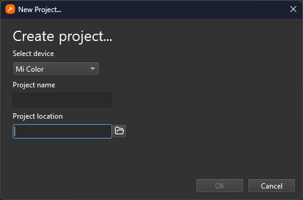
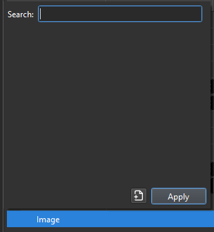

# Basics

{: .no_toc }

  

    Table of contents
  

  {: .text-delta }
- TOC
{:toc}

---

## Creating a Watchface

Mi Create is a watchface creation tool for newer Xiaomi watches/bands. It is the core application for creating custom watchfaces on these devices.

**Widgets** are the main components of your watchface, things like images, analog hands, digital numbers, etc. The **Canvas** is the area where your watchface will be previewed. **Building** is the act of compiling your watchface project into a format thats readable by the watch.

Create a watchface by pressing `Ctrl` `N` or by pressing the `New Project` link in the Welcome page. You will be greeted by the New Project dialog.

Start by selecting the device you want to make your watchface for in the Select device dropdown, naming your project and setting where the project will be created.

From here, a blank watchface canvas will be displayed. Zoom in and out of the canvas by clicking in the canvas and pressing `Ctrl` `+` / `Ctrl` `-`. Alternatively, you can hold `Ctrl` and scroll your mouse wheel, or simply pinching in and out with your laptop's trackpad. 

---

## Adding and Configuring Widgets

To create a widget, press the `Create Widget` dropdown and select a widget. It will immediately be created to the center of the watchface. 

Once the widget has been created and selected, head over to the Properties panel to modify the position and appearance of the widget.

---

## Adding Images

Nearly all widgets require images to display, Digital Number widgets require a list of images to represent numbers, Analog widgets require images to represent the hands of an analog clock, and the Image widget requires a static image to display.

To add an image, select the blank image field in the Properties panel. A popup will appear, containing a list of images in the `images` folder in your project.

Add an image to the list by pressing the  `Add Image` button. Select the image you would like to display, and the image immediately gets selected over into the list

[Prefixes >](https://ooflet.github.io/docs/quickstart/prefix){: .btn .btn-blue }

