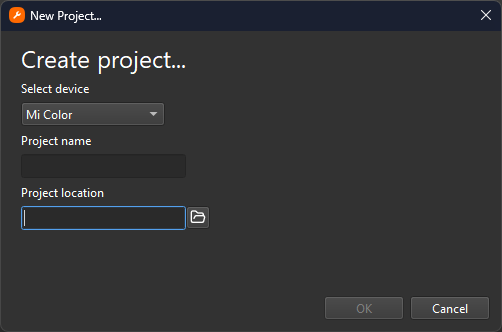

# Introduction

Introduction to Mi Create

{: .no_toc }

  

    Table of contents
  

  {: .text-delta }
- TOC
{:toc}

---

## Creating a Watchface

Mi Create is a watchface creation tool. It is a graphical program for creating and editing custom watchfaces on Xiaomi wearables.

**Widgets** are the components of your watchface, things like images, analog hands, digital numbers, etc. The **Canvas** is the part of the program where your watchface is previewed and editable. **Building** is the act of compiling your watchface project into a format thats readable by the watch.

Create a watchface by pressing `Ctrl` + `N` or by pressing the `New Project` link in the Welcome page. You will be greeted by the New Project dialog.

Start by selecting the device you want to make your watchface for in the Select device dropdown, naming your project and setting where the project will be created.

From here, a blank watchface canvas will be displayed. Zoom in and out of the canvas by clicking in the canvas and pressing `Ctrl` `+` / `Ctrl` `-`. Alternatively, you can hold `Ctrl` and scroll your mouse wheel, or simply pressing the  Zoom In and  Zoom Out buttons on the toolbar.

---

## Adding and Configuring Widgets

To create a widget, press the  create button on the top left and select a widget on the dropdown that appears. It will be created to the center of the watchface. 

Once the widget has been created and selected, head over to the Properties panel to modify the position and appearance of the widget.

---

## Adding Images

All widgets require images to display, Digital Number widgets require a list of images to represent numbers, Analog widgets require images to represent the hands of an analog clock, and the Image widget requires a static image to display.

To add an image, press the  `Add Image` button which is located at the bottom of the resources panel. 

Once the image is added, you may either drag and drop the image onto the image field, or select the dropdown to the right of the field to show a list of all the available images and select your image from there.

If your image is not there in the dropdown, reselect the object.

[Testing your Watchface >](https://ooflet.github.io/docs/quickstart/prefix){: .btn .btn-blue }

