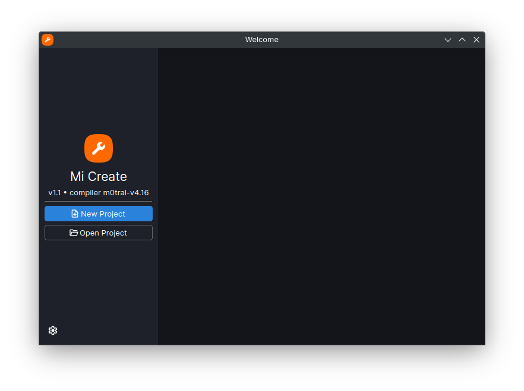
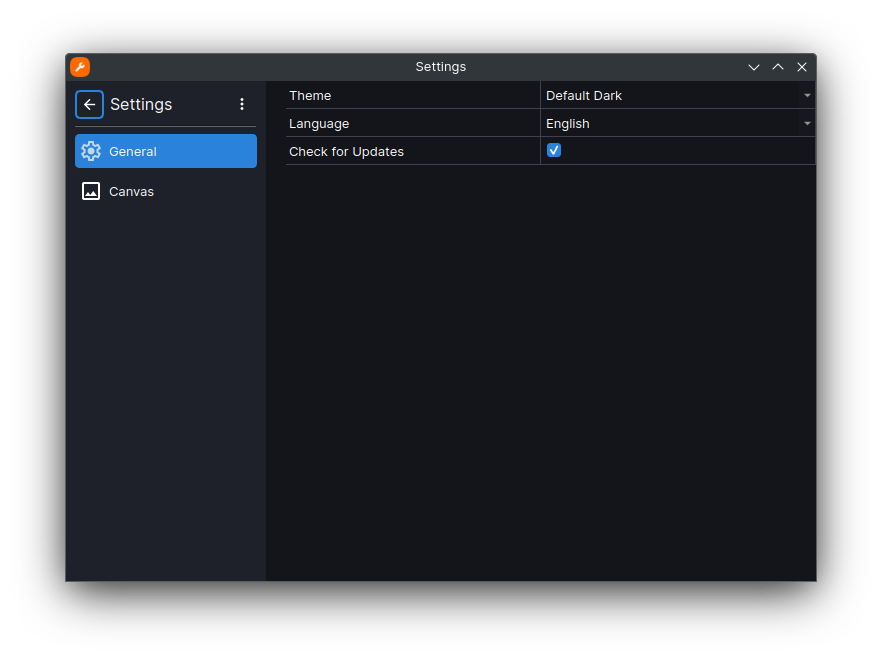
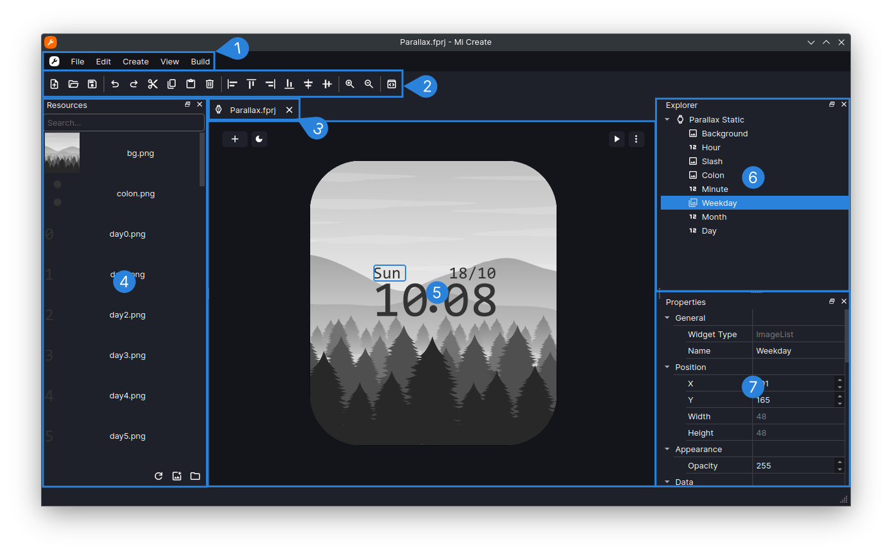
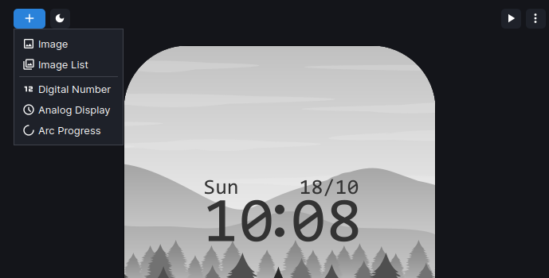
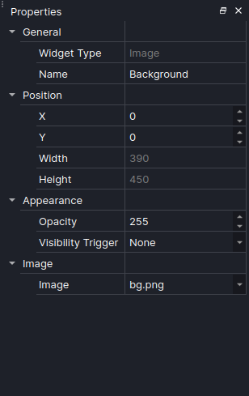

# Introduction

Introduction to Mi Create

---

## Introduction

Mi Create is a watchface creation tool. It is a graphical program for creating and editing custom watchfaces on Xiaomi wearables.

**Widgets** are the components of your watchface, things like images, analog hands, digital numbers, etc. The **Canvas** is the part of the program where your watchface is previewed and editable. **Building** is the act of compiling your watchface project into a format thats readable by the watch.

---

## Welcome page

When starting Mi Create, you will see the Welcome page. The dialog also shows when all projects are closed.

A list of recent projects will appear on the right hand side.

---

## Configure Mi Create

Click the **Gear icon** in the **Welcome Page** to configure Mi Create's settings.

Alternatively when a project is open you can click **Edit > Settings** or ++ctrl+comma++ to access the settings page

If the program is slow when adding and moving widgets, you may like to tweak a few settings in here to help with performance:

- Clip to Device Shape enables rounding the corners of the canvas to the corner radius of the watch. This can make the canvas slow and laggy. If this is not enabled, the classic rounded white outline from EasyFace which defines the bounds of the watchface will be shown instead.
- Turning on Performance Outlines disables the handling of object outlines as seperate items, drawing them directly as outlines on the widget. This comes as a decent performance boost, but if you're using Clip to Device Shape the outlines will be clipped out alongside the widget, which means the oulines will be less visible. Performace outlines are also drawn underneath the image, so the image can cover a significant portion of the outline.
- Antialiasing helps hide jagged lines present when drawing non-straight objects. Antialiasing is usually unnecessary because it only applies to vector objects in the canvas, such as progress arc borders. Disabling this may help with performance slighly.
- Image Interpolation is the way zoomed in images are handled. By default, this is set to Bilinear which "blurs" neighbouring pixels to make it look smoother. Nearest neighbour however preserves the pixels making things look more pixelated. Below is the difference between bilinear and nearest neighbour, where nearest neighbour is pictured on the left and bilinear is on the right:

  

*Artwork from <https://www.deviantart.com/gelik1html/art/HSR-Render-Silver-Wolf-Chibi-1011345132>*

---

## Create a watchface project

Watchfaces are done in projects, which hold images and information about the watchface.

There are 2 implemented project formats in Mi Create:

- .fprj (EasyFace/m0tral)
- wfDef.json (GMF)

Each project format has their own benefits and disadvantages. You may view them in the [formats](project/formats) page.

Click  the **New Project** button in the **Welcome Page** to open the New Project page.

Alternatively when a project is open you can click **File > New...** or ++ctrl+n++ to access the settings page

Select the device you want to make your watchface for in the Select device dropdown, name your project and set where the project will be created.

!!! tip

    The project name will not be the name the watch will show. You may set the project name to something simple and then set the
    full name of the watchface in the Manage Project dialog.

---

## Watchface editor

1. The **Menu bar** contains a set of menus:
      - **Logo menu** allows you to access documentation, welcome page, about information and exiting Mi Create
      - **File menu** contains tools to create or close projects and edit project info
      - **Edit menu** edits widgets in the current project, or access Mi Create settings
      - **Create menu** creates widgets in the current project
      - **View menu** shows or hides toolbars/dock widgets and has window actions
      - **Build menu** contains tools to build a project
2. **Toolbar** contains a set of actions to manipulate a project
3. **Project tabs** allow you to open multiple projects at once and access them
4. **Resources panel** shows a list of searchable resources and allows you to add resources
5. **Canvas** shows an interactive watchface preview
6. **Explorer** shows the list of widgets in the project
7. **Properties** shows all properties of a widget

---

## Using the canvas

The canvas displays an editable preview of your watchface. 

Zoom in and out of the canvas by clicking in the canvas and pressing ++ctrl+plus++ / ++ctrl+minus++. Alternatively, you can hold ++ctrl++ and scroll your mouse wheel, or simply pressing the  Zoom In and  Zoom Out buttons on the toolbar.

Delete a widget by pressing the ++delete++ key

---

## Adding and configuring widgets

To create a widget, press the  create button on the top left and select a widget on the dropdown that appears. It will be created to the center of the watchface. 

Alternatively to add an image widget quickly you can drag and drop the widget from the resources panel to the canvas.

Once the widget has been created and selected, head over to the Properties panel to modify the position and appearance of the widget.

!!! note 

    Xiaomi wearables are by all means not powerful devices compared to proper smartwatches like Apple Watches and Wear OS Watches, so there are some things you might need to take into consideration when designing your watchface:

    - **Attempt to use the least amount of storage on your watchface.** Xiaomi watches usually don't have much storage for watchfaces. Big, colourful images take up a decent chunk of storage. Aim for watchfaces with >5MB final file size, so that you save storage space on the watch and have faster transfer time from your phone to your watch.
    - **Try using as little widgets as possible.** Do things like merge static images and icons as one single image widget.
    - **Use transparent images (_RGBA/RGBA32) sparingly** especially on watches with no watchface compression. Transparent widgets take up way more storage than regular images.
    - **When creating animations, don't make them too big or use too many frames.** Your watch most likely cannot handle full screen animations at 20-30fps, let alone 60. So, save some resources and make small, simple animations. Refrain from making full screen animations.