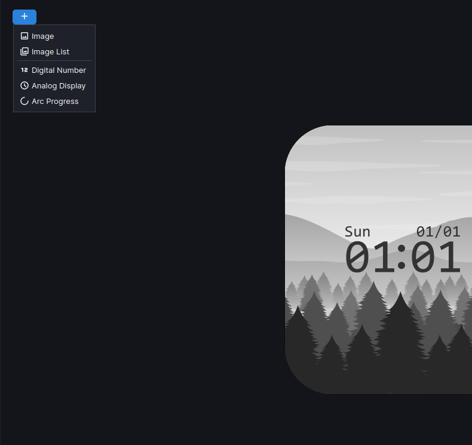
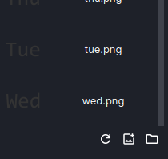

# Introduction

Introduction to Mi Create

---

## Creating a Watchface

Mi Create is a watchface creation tool. It is a graphical program for creating and editing custom watchfaces on Xiaomi wearables.

**Widgets** are the components of your watchface, things like images, analog hands, digital numbers, etc. The **Canvas** is the part of the program where your watchface is previewed and editable. **Building** is the act of compiling your watchface project into a format thats readable by the watch.

Create a watchface by pressing ++ctrl+n++ or by pressing the `New Project` link in the Welcome page. You will be greeted by the New Project dialog.

Start by selecting the device you want to make your watchface for in the Select device dropdown, naming your project and setting where the project will be created.

From here, a blank watchface canvas will be displayed. Zoom in and out of the canvas by clicking in the canvas and pressing ++ctrl+plus++ / ++ctrl+minus++. Alternatively, you can hold ++ctrl++ and scroll your mouse wheel, or simply pressing the  Zoom In and  Zoom Out buttons on the toolbar.

---

## Adding and Configuring Widgets

!!! tip

    If the program is slow when adding and moving widgets, you may like to tweak a few settings (++ctrl+p++) to help with performance

    - Clip to Device Shape enables rounding the corners of the canvas to the corner radius of the watch. This can make the canvas slow and laggy. If this is not enabled, the classic rounded white outline from EasyFace which defines the bounds of the watchface will be shown instead.
    - Turning on Performance Outlines disables the handling of object outlines as seperate items, drawing them directly as outlines on the widget. This comes as a decent performance boost, but if you're using Clip to Device Shape the outlines will be clipped out alongside the widget, which means the oulines will be less visible. Performace outlines are also drawn underneath the image, so the image can cover a significant portion of the outline.
    - Antialiasing helps hide jagged lines present when drawing non-straight objects. Antialiasing is usually unnecessary because it only applies to vector objects in the canvas, such as progress arc borders. Disabling this may help with performance slighly.
    - Image Interpolation is the way zoomed in images are handled. By default, this is set to Bilinear which "blurs" neighbouring pixels to make it look smoother. Nearest neighbour however preserves the pixels making things look more pixelated. Below is the difference between bilinear and nearest neighbour, where nearest neighbour is pictured on the left and bilinear is on the right:

      

    *Artwork from <https://www.deviantart.com/gelik1html/art/HSR-Render-Silver-Wolf-Chibi-1011345132>*

To create a widget, press the  create button on the top left and select a widget on the dropdown that appears. It will be created to the center of the watchface. 

Once the widget has been created and selected, head over to the Properties panel to modify the position and appearance of the widget.

---

## Adding Images

All widgets require images to display, Digital Number widgets require a list of images to represent numbers, Analog widgets require images to represent the hands of an analog clock, and the Image widget requires a static image to display.

To add an image, press the  `Add Image` button which is located at the bottom of the resources panel. 

Once the image is added, you may either drag and drop the image onto the image field, or select the dropdown to the right of the field to show a list of all the available images and select your image from there.

If your image is not there in the dropdown, reselect the object.

!!! note 

    Xiaomi wearables are by all means not powerful devices compared to proper smartwatches like Apple Watches and Wear OS Watches, so there are some things you might need to take into consideration when designing your watchface:

    - **Attempt to use the least amount of storage on your watchface.** Xiaomi watches usually don't have much storage for watchfaces. Big, colourful images take up a decent chunk of storage. Aim for watchfaces with >5MB final file size, so that you save storage space on the watch and have faster transfer time from your phone to your watch.
    - **Try using as little widgets as possible.** Do things like merge static images and icons as one single image widget.
    - **Use transparent images (_RGBA/RGBA32) sparingly** especially on watches with no watchface compression. Transparent widgets take up way more storage than regular images.
    - **When creating animations, don't make them too big or use too many frames.** Your watch most likely cannot handle full screen animations at 20-30fps, let alone 60. So, save some resources and make small, simple animations. Refrain from making full screen animations.