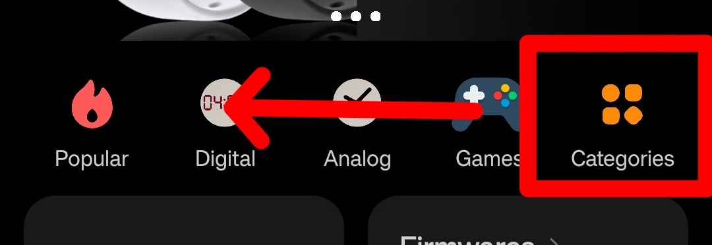

# Testing your Watchface

Test out your watchface. This guide primarily focuses on m0tral's custom Mi Fitness mod and servers.

---

## Prerequisites
There are many ways to transfer watchfaces to your watch. The recommended way is to gain access to @m0tral's watchface database and install your watchface through there. You may like to follow these steps in advance; they make take a while.

!!! note
    
    The modded Mi Fitness app is only available on Android.

To gain access to the servers:

1. **Join the [@mi_watch_int](https://t.me/mi_watch_int/) Telegram group.**
If you do not have the Telegram app, please install it and create an account. This is necessary for registration onto the servers. Open Telegram and join the Telegram group. 

2. **Message @mi_watch_bot /latestapp to get the latest Mi Fitness mod app.**
Once joined, message @mi_watch_bot the command /latestapp to get a link to the latest Mi Fitness mod application. Install it and setup your watch as per usual.

3. **Message any group admin with your wearable's MAC address to gain access to the development servers**
Once you have the modified Mi Fitness app, all you need to do now is gain access to the development to upload your watchface. Message any group admin or @m0tral your wearable's MAC address for access to the development servers. You may also request an invitation to the Mi Watch Development Telegram group to gain access to a chat with experienced watchface developers if you have any further questions.

!!! tip

    If you are running Android >13 and get the "Restricted setting" popup when giving permissions to the Mi Fitness mod, you will need to unlock application permissions.

    1. Open the apps list in settings (Settings > Apps > Show all apps/Settings > Apps > App Management) 
    2. Choose Mi Fitness from the list
    3. Tap on the top right corner menu (3 dots)
    4. Select "Allow restricted settings"

---

## Testing your Watchface

!!! warning

    **You may brick your device testing out custom watchfaces.** If your watch does not have 
    good recovery, you risk breaking your watch entirely. Some watches with known bad
    recovery/no recovery:

    - Xiaomi Smart Band 8
    - Xiaomi Watch S1 Pro
    - Xiaomi Watch S3
    - Redmi Watch 3

    However, watches that run NuttX (Xiaomi Vela/RW4 HyperOS) have really good recovery. 
    You do not need to worry about bricking your device unless you have messed with system
    software. The following devices run NuttX:

    - Xiaomi Smart Band 8 Pro
    - Redmi Watch 4
   
    There are some strategies to prevent bricking your watch, listed later on.

Once you're ready to test out your watchface, you can build/compile it to a format that is readable by the watch. To build your watchface:

1. In the toolbar, select the  build button
2. In the popup that appears, fill the following fields:
   - Watchface name - The name of the watchface that appears in the watch
   - Watchface thumbnail - The thumbnail of the watchface that appears in the watch
3. The watchface will be built using the data that is saved **in the project files**, not in the application. You can choose whether to:
   - Save - Save open project to file before building
   - Discard - Dont save anything to file before building
4. Check build results for any errors.

Your watchface binary will be in the output folder in your project.

---

## Debugging

There may have been some watchface errors that slipped through build errors. These errors may brick your device. A way to check for these errors is to unpack the watchface, if any errors occur from unpacking there may have been a bug in your watchface. Please report these bugs to the Mi Watch Development group on Telegram for further assistance.

---

## Transferring to your watch
!!! note

    The .FACE file in your project's output folder is your watchface binary. Rename it to .bin if you are uploading to another service.

If you have access to the @m0tral's development servers, access the admin panel at https://miwatch.conversmod.ru/micolor/facemain?YOUR-MAC-ADDRESS-HERE and upload your watchface on the bottom panel. You can apply it in Mi Fitness > Watchfaces > Categories > Test RU 

