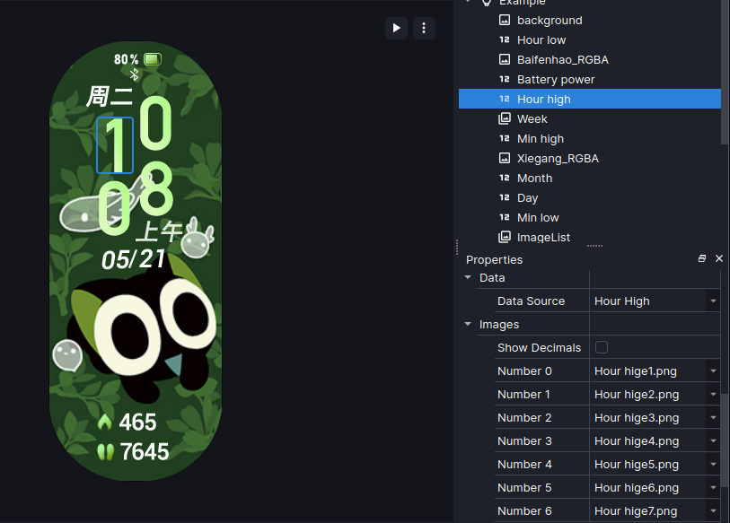
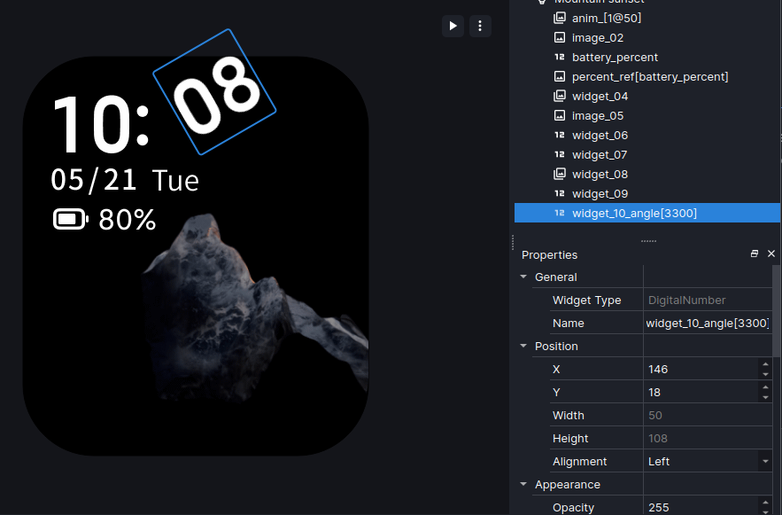
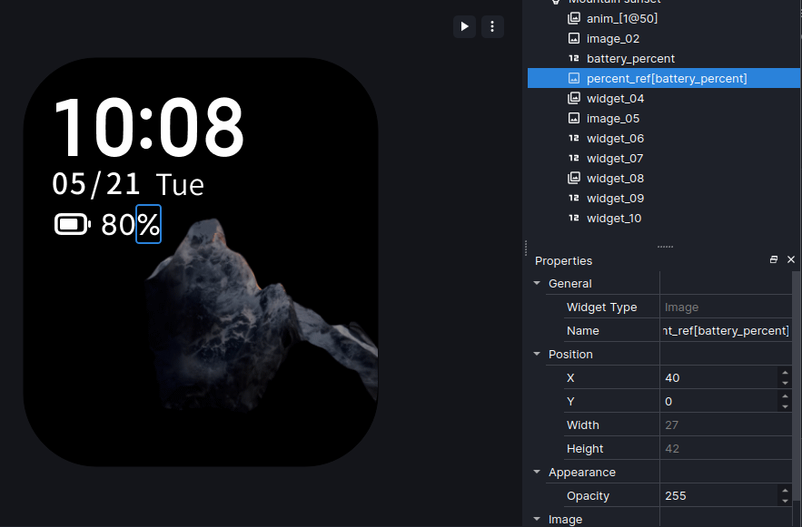

# Digital Number
The Digital Number widget displays numbers from the selected source.

---

## Detailed Description
The Digital Number widget displays numbers provided by the source. Width and Height are automatically set.

Digital Numbers rely on data sources. If a source is not available in the program and you would like to have it added, first check the [data source list](https://github.com/ooflet/Mi-Create/files/15058856/dataSrc_list.txt) to see if it is available as a source and request it through [issues](https://github.com/ooflet/Mi-Create/issues)

!!! note

    For Mi Band 7 Pro and Mi Band 8, to display hours, minutes and seconds each digit has to be its own number widget (Hour High, Hour Low, Minute High, Minute Low, etc). Each widget also needs a seperate list of images (however setting just the negative image to be different for each set works fine) otherwise it will display incorrectly.

    

You can set an angle by using the `_angle[x]` suffix on the name where x is the angle × 10. The alignment property sets the "pivot point" (what point the widget rotates on) where "Left" sets it to the top left, "Center" sets it to the top center and "Right" sets it to the top right.

You can also set an "unit image" (%, °, etc) by creating an image widget and adding the `_ref[widget]` suffix on the name where widget is the number widget you want to add the unit image onto.

Mi Create previews these parameters in the canvas.

---

## Properties
#### General

|Name |
|:----------|
|Widget name|

#### Position

|X |
|:----------|
|Horizontal position|

|Y |
|:----------|
|Vertical position|

|Width (disabled)|
|:----------|
|Widget width, automatically set by image|

|Height (disabled)|
|:----------|
|Widget height, automatically set by image|

|Alignment|
|:----------|
|Alignment of the numbers|

#### Appearance

|Opacity|
|:----------|
|Widget transparency|

|Digits|
|:----------|
|Amount of digits to display|

|Spacing|
|:----------|
|Spacing between digits|

|Hide Zeroes|
|:----------|
|Hide leading zeroes in a number|

|Visibility Trigger|
|:----------|
|Display the widget based on the source's value|
|*Only visible on Xiaomi Watch Color/Sport/2/S1/S1 Pro/S2*| 

#### Image

|Image |
|:----------|
|The image to be displayed|